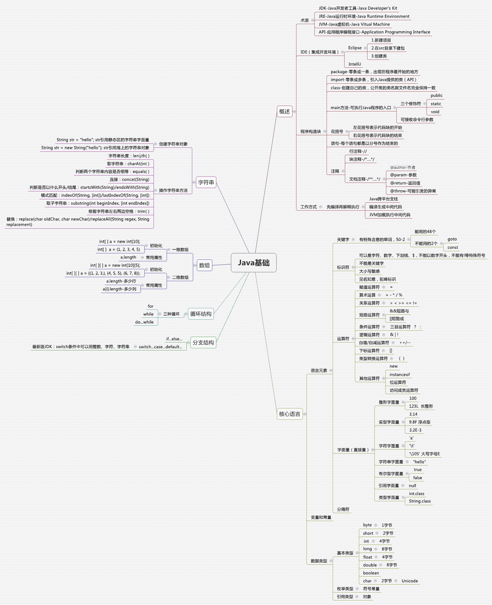

# java基础-基本介绍

推荐阅读[java开发实战经典](../README.md)



### 数据类型

  

### 程序结构

**顺序结构**

```java
{
    //逻辑代码一
    //逻辑代码二
}
```

**选择结构**

* if

  ```java
  if(x  > 90){
      //逻辑代码一
  }else if(x > 80){
      //逻辑代码二
  }else{
      //逻辑代码三
  }
  ```

* switch

```java
switch(x){
    case 1://逻辑代码一
    	break;
    case 2://逻辑代码二
    	break;
    default://逻辑代码三
}
```

**循环结构**

* while

  ```java
  while(x > 0){
      x --;
      //业务逻辑处理
  }
  ```

* do...while

  ```java
  do{
      x--;
      //业务逻辑代码
  }while(x> 0)
  ```

* for 

  ```java
  for(int i=0;i<10;i++){
      //业务逻辑代码
  }
  ```

* 循环中断语句

  * break: 中断循环
  * contine: 中断本次执行

### 访问权限

Java 中有三个访问权限修饰符: private、protected 以及 public，如果不加访问修饰符，表示包级可见。

- 类可见表示其它类可以用这个类创建实例对象。

- 成员可见表示其它类可以用这个类的实例对象访问到该成员；

- 设计良好的模块会隐藏所有的实现细节，把它的 API 与它的实现清晰地隔离开来。模块之间只通过它们的 API 进行通信，一个模块不需要知道其他模块的内部工作情况，这个概念被称为信息隐藏或封装。因此访问权限应当尽可能地使每个类或者成员不被外界访问。

  ```java
  private String name;//属性设置为私有
  //通过方法来获取或者修改属性值
  public String getName(){return this.name;}
  public String setName(String name){this.name=name}
  ```

### 参数传递

Java 的参数是以值传递的形式传入方法中，而不是引用传递。

但是java将对象当做入参传递时，传递的是对象的地址，在方法中修改对象的值，实际上修改了对象地址所指向的对象，造成了引用传递的假象。

```java
/**
 * 参数传递
 */
public class ParamTransfer {
    public static void main(String[] args) {
        User user = new User();
        user.setName("张三");
        user.setAge(40);
        ParamTransfer.modify(user);
        System.out.println(user);
    }
    public static void modify(User user){
        //通过引用指向的地址修改值可以修改成功
        user.setAge(50);
        //修改了引用的地址，导致后续修改和传入的引用没有关系
        user = new User();
        user.setName("李四");
        user.setAge(30);
    }
}
@Data
class User{
    private String name;
    private Integer age;
    @Override
    public String toString() {
        return "User{" +
                "name='" + name + '\'' +
                ", age=" + age +
                '}';
    }
}
```

### 抽象类与接口

#### 抽象类

* 抽象类和抽象方法都使用 abstract 关键字进行声明。抽象类一般会包含抽象方法，抽象方法一定位于抽象类中。
* 抽象类和普通类最大的区别是，抽象类不能被实例化，需要继承抽象类才能实例化其子类。

#### 接口

* 接口是抽象类的延伸，在 Java 8 之前，它可以看成是一个完全抽象的类，也就是说它不能有任何的方法实现。

* 从 Java 8 开始，接口也可以拥有默认的方法实现，这是因为不支持默认方法的接口的维护成本太高了。在 Java 8 之前，如果一个接口想要添加新的方法，那么要修改所有实现了该接口的类。

* 接口的成员(字段 + 方法)默认都是 public 的，并且不允许定义为 private 或者 protected。

* 接口的字段默认都是 static 和 final 的。

### 重写与重载

#### 重写

存在于继承体系中，指子类实现了一个与父类在方法声明上完全相同的一个方法。

为了满足里式替换原则，重写有以下两个限制:

- 子类方法的访问权限必须大于等于父类方法；
- 子类方法的返回类型必须是父类方法返回类型或为其子类型。

使用 @Override 注解，可以让编译器帮忙检查是否满足上面的两个限制条件。(一般公司会强制要求写，养成好习惯)

#### 重载

* 存在于同一个类中，指一个方法与已经存在的方法名称上相同，但是参数类型、个数、顺序至少有一个不同。

* 应该注意的是，返回值不同，其它都相同不算是重载。（这里编译器会报错）


**参考**

[Java 基础 - 图谱 & Q/A](https://pdai.tech/md/java/basic/java-basic-lan-sum.html)
