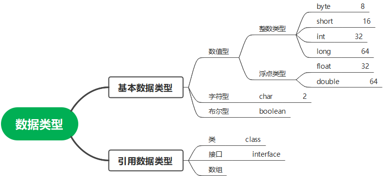

# java基础

推荐阅读[java开发实战经典](../README.md)

## 一、简单的java程序

### 注释

* 单行注释： 

  ```java
  //单行注释
  ```

* 多行注释

  ```
  /*
   多行注释
  */
  ```

* 文档注释

  ```java
  /**
   * 文档注释
   */
  ```

### 数据类型

  

### 程序结构

**顺序结构**

```java
{
    //逻辑代码一
    //逻辑代码二
}
```

**选择结构**

* if

  ```java
  if(x  > 90){
      //逻辑代码一
  }else if(x > 80){
      //逻辑代码二
  }else{
      //逻辑代码三
  }
  ```

* switch

```java
switch(x){
    case 1://逻辑代码一
    	break;
    case 2://逻辑代码二
    	break;
    default://逻辑代码三
}
```

**循环结构**

* while

  ```java
  while(x > 0){
      x --;
      //业务逻辑处理
  }
  ```

* do...while

  ```java
  do{
      x--;
      //业务逻辑代码
  }while(x> 0)
  ```

* for 

  ```java
  for(int i=0;i<10;i++){
      //业务逻辑代码
  }
  ```

* 循环中断语句

  * break: 中断循环
  * contine: 中断本次执行

### 数组

* 数组声明

  ```java
  数据类型 数组名[] = new 数据类型[数组长度];
  int intArray[] = new int[10];
  ```

* 数组静态初始化

  ```java
  int score[] = {10,100,99};
  ```

### 其他

**三目运算符**

```java
boolean greaterZero = x > 0 ?  true: false;
```

