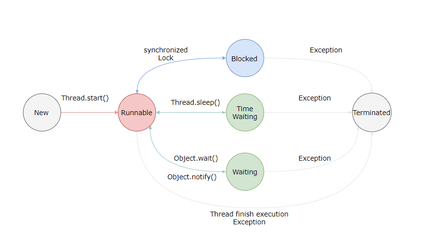

# java多线程-线程基础
## 线程状态扭转

## 线程实现的方式
* 实现 Runnable 接口；
* 实现 Callable 接口；
* 继承 Thread 类。
    
**实现接口 VS 继承 Thread**
* Java 不支持多重继承，因此继承了 Thread 类就无法继承其它类，但是可以实现多个接口；
* 类可能只要求可执行就行，继承整个 Thread 类开销过大。

## synchronized与ReentrantLock对比
* synchronized 是 JVM 实现的，而 ReentrantLock 是 JDK 实现的。
* 新版本 Java 对 synchronized 进行了很多优化，例如自旋锁等，synchronized 与 ReentrantLock 大致相同。
* 当持有锁的线程长期不释放锁的时候，正在等待的线程可以选择放弃等待，改为处理其他事情。ReentrantLock 可中断，而 synchronized 不行。
* synchronized 中的锁是非公平的，ReentrantLock 默认情况下也是非公平的，但是也可以是公平的。
* 一个 ReentrantLock 可以同时绑定多个 Condition 对象
* 除非需要使用 ReentrantLock 的高级功能，否则优先使用 synchronized。这是因为 synchronized 是 JVM 实现的一种锁机制，JVM 原生地支持它，而 ReentrantLock 不是所有的 JDK 版本都支持
* 使用 synchronized 不用担心没有释放锁而导致死锁问题，因为 JVM 会确保锁的释放

## 其他
**Daemon**
* 守护线程是程序运行时在后台提供服务的线程，不属于程序中不可或缺的部分。
* 当所有非守护线程结束时，程序也就终止，同时会杀死所有守护线程。
* main() 属于非守护线程。
* 使用 setDaemon() 方法将一个线程设置为守护线程。

**sleep**
* Thread.sleep(millisec) 方法会休眠当前正在执行的线程，millisec 单位为毫秒。
* sleep() 可能会抛出 InterruptedException，因为异常不能跨线程传播回 main() 中，因此必须在本地进行处理。线程中抛出的其它异常也同样需要在本地进行处理。

**yield()**
* 对静态方法 Thread.yield() 的调用声明了当前线程已经完成了生命周期中最重要的部分，可以切换给其它线程来执行
* 该方法只是对线程调度器的一个建议，而且也只是建议具有相同优先级的其它线程可以运行。

**线程中断**
* 一个线程执行完毕之后会自动结束，如果在运行过程中发生异常也会提前结束。

**interrupted()**
* 如果一个线程的 run() 方法执行一个无限循环，并且没有执行 sleep() 等会抛出 InterruptedException 的操作，那么调用线程的 interrupt() 方法就无法使线程提前结束。
* 但是调用 interrupt() 方法会设置线程的中断标记，此时调用 interrupted() 方法会返回 true。因此可以在循环体中使用 interrupted() 方法来判断线程是否处于中断状态，从而提前结束线程。

**join()**
* 在线程中调用另一个线程的 join() 方法，会将当前线程挂起，而不是忙等待，直到目标线程结束。

**wait() notify() notifyAll()**
* 调用 wait() 使得线程等待某个条件满足，线程在等待时会被挂起，当其他线程的运行使得这个条件满足时，其它线程会调用 notify() 或者 notifyAll() 来唤醒挂起的线程

**await() signal() signalAll()**
* java.util.concurrent 类库中提供了 Condition 类来实现线程之间的协调，可以在 Condition 上调用 await() 方法使线程等待，其它线程调用 signal() 或 signalAll() 方法唤醒等待的线程。相比于 wait() 这种等待方式，await() 可以指定等待的条件，因此更加灵活。

