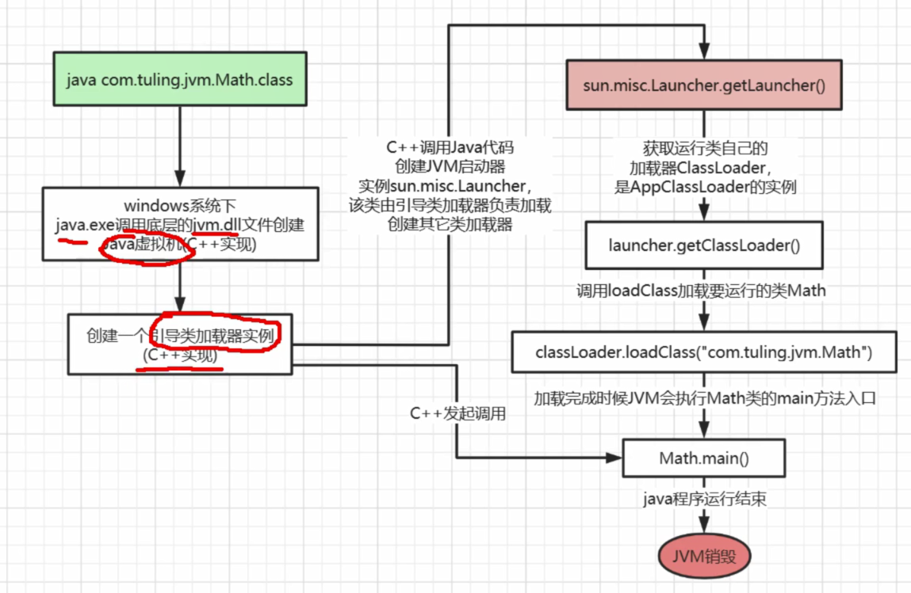
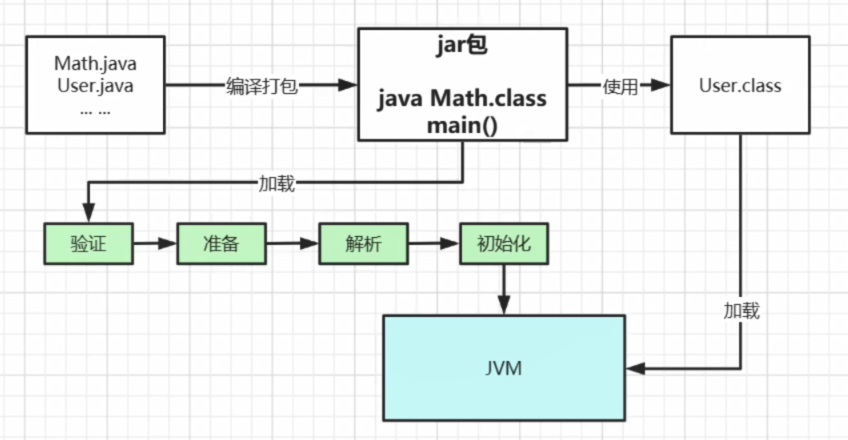
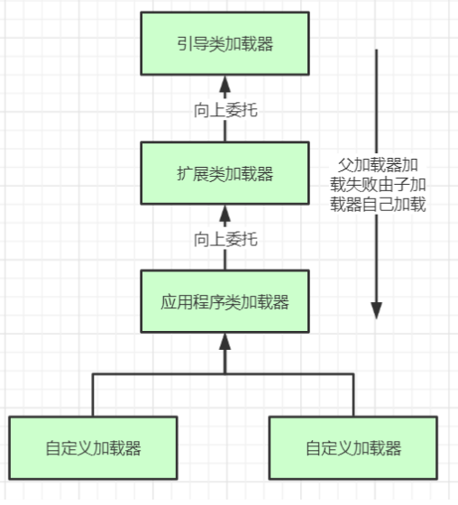

### 1. 类加载器初始化以及加载过程



**类加载过程**



* 加载：在硬盘上查找并通过IO读入字节码文件，使用到类时才会加载，例如调用调用类的	main()方法，new对象，在加载阶段会在内存中生成一个代表这个类的 java.lang.Class对象，作为这个类的各种数据的入口。
* 验证：校验字节码文件的正确性
* 准备：给类的静态变量分配内存，并赋予默认值
* 解析：将**符号引用**替换为直接引用，该阶段会把一些静态方法(符号引用，比如main()方法)替换为指向数据所存内存的指针或句柄等(直接引用)，这是所谓的**静态链接**过程(类加载期间完成)。**动态链接**是在程序运行期间完成的将符号引用替换为直接引用。
* 初始化：对类的静态变量初始化为指定的值，执行静态代码块
* 使用：
* 卸载：

类加载到方法去中后主要包含**运行时常量池、类型信息、字段信息、方法信息、类加载器的引用、对应class类实例的引用**

**类加载器的使用**：这个类到类加载器实例的引用

**对应class实例的引用**：类加载器在加载类信息放到方法区中后，会创建一个对应的Class 类型的对象实例放到堆(Heap)中, 作为开发人员访问方法区中类定义的入口和切入点。

**注意**:主类在运行过程中如果使用到其它类，会逐步加载这些类。jar包或war包里的类不是一次性全部加载的，是使用到时才加载。

### 2. 类加载器和双亲委派机制

**java主要类加载器**

* 引导类加载器：**C++语言**实现的，负责加载支撑JVM运行的位于JRE的lib目录下面的核心类库，比如rt.ja、charsets.jar等
* 扩展类加载器：负责加载支撑JVM运行的位于JRE的lib目录下的ext扩展目录中的JAR类包
* 应用程序类加载器：负责加载ClassPath路径下的类包，主要就是加载你自己写的那些类
* 自定义加载器：负责加载用户自定义路径下的类包

关注**sun.misc.Launcher**

```java
public Launcher() {
        ExtClassLoader var1;
        try {
            var1 = Launcher.ExtClassLoader.getExtClassLoader();
        } catch (IOException var10) {
            throw new InternalError("Could not create extension class loader", var10);
        }

        try {
            this.loader = Launcher.AppClassLoader.getAppClassLoader(var1);
        } catch (IOException var9) {
            throw new InternalError("Could not create application class loader", var9);
        }

        Thread.currentThread().setContextClassLoader(this.loader);
        String var2 = System.getProperty("java.security.manager");
        if (var2 != null) {
            SecurityManager var3 = null;
            if (!"".equals(var2) && !"default".equals(var2)) {
                try {
                    var3 = (SecurityManager)this.loader.loadClass(var2).newInstance();
                } catch (IllegalAccessException var5) {
                } catch (InstantiationException var6) {
                } catch (ClassNotFoundException var7) {
                } catch (ClassCastException var8) {
                }
            } else {
                var3 = new SecurityManager();
            }

            if (var3 == null) {
                throw new InternalError("Could not create SecurityManager: " + var2);
            }

            System.setSecurityManager(var3);
        }

    }
}
```

**双亲委派机制**



这里类加载其实就有一个**双亲委派机制**，加载某个类时会先委托父加载器寻找目标类，找不到再

委托上层父加载器加载，如果所有父加载器在自己的加载类路径下都找不到目标类，则在自己的

类加载路径中查找并载入目标类。

比如我们的Math类，最先会找应用程序类加载器加载，应用程序类加载器会先委托扩展类加载

器加载，扩展类加载器再委托引导类加载器，顶层引导类加载器在自己的类加载路径里找了半天

没找到Math类，则向下退回加载Math类的请求，扩展类加载器收到回复就自己加载，在自己的

类加载路径里找了半天也没找到Math类，又向下退回Math类的加载请求给应用程序类加载器，

应用程序类加载器于是在自己的类加载路径里找Math类，结果找到了就自己加载了。。

**双亲委派机制说简单点就是，先找父亲加载，不行再由儿子自己加载**

**为什么设计双亲委派机制？**

* 沙箱安全机制：自己写的java.lang.String.class类不会被加载，这样便可以防止核心API库被随意篡改

* 避免类的重复加载：当父亲已经加载了该类时，就没有必要子ClassLoader再加载一次，保证**被加载类的唯一性**

**全盘负责委托机制**

“**全盘负责**”是指当一个ClassLoder装载一个类时，除非显示的使用另外一个ClassLoder，该类所依赖及引用的类也由这个ClassLoder载入。

**自定义类加载器**

1. 继承 java.lang.ClassLoader 类

2. 该类有两个核心方法，一个是loadClass(String, boolean)，实现了**双亲委派机制**，还有一个方法是findClass，默认实现是空

   方法，所以我们自定义类加载器主要是**重写**findClass**方法**

   ```java
   	static class MyClassLoader1 extends ClassLoader {
           private String classPath;
   
           public MyClassLoader1(String classPath) {
               this.classPath = classPath;
           }
   
           @Override
           protected Class<?> findClass(String name) throws ClassNotFoundException {
               try {
                   byte[] data = loadByte(name);
                   //defineClass将一个字节数组转为Class对象，这个字节数组是class文件读取后最终的字节 数组。
                   return defineClass(name, data, 0, data.length);
               } catch (Exception e) {
                   throw new ClassNotFoundException();
               }
   
           }
   
           private byte[] loadByte(String name) throws Exception {
               name = name.replaceAll("\\.", "/");
               FileInputStream fis = new FileInputStream(classPath + "/" + name + ".class");
               int len = fis.available();
               byte[] data = new byte[len];
               fis.read(data);
               fis.close();
               return data;
           }
       }
   ```

**打破双亲委派机制**

1. 继承 java.lang.ClassLoader 类
2. 打破双亲委派机制直接重写**loadClass**

```java
static class MyClassLoader extends ClassLoader {
        private String classPath;

        public MyClassLoader(String classPath) {
            this.classPath = classPath;
        }

        @Override
        public Class<?> findClass(String name) throws ClassNotFoundException {
            try {
                byte[] data = loadByte(name);
                //defineClass将一个字节数组转为Class对象，这个字节数组是class文件读取后最终的字节 数组。
                return defineClass(name, data, 0, data.length);
            } catch (Exception e) {
                throw new ClassNotFoundException();
            }

        }

        private byte[] loadByte(String name) throws Exception {
            name = name.replaceAll("\\.", "/");
            FileInputStream fis = new FileInputStream(classPath + "/" + name + ".class");
            int len = fis.available();
            byte[] data = new byte[len];
            fis.read(data);
            fis.close();
            return data;
        }

        protected Class<?> loadClass(String name, boolean resolve) throws ClassNotFoundException {
            synchronized (getClassLoadingLock(name)) {
                Class<?> c = findLoadedClass(name);
                if (c == null) {
                    long t1 = System.nanoTime();

                    if(!name.startsWith("com.hsm")){
                        //非自定义的类还是走双亲委派加载
                        c = this.getParent().loadClass(name);
                    }else{
                        c = findClass(name);
                    }
                    sun.misc.PerfCounter.getFindClassTime().addElapsedTimeFrom(t1);
                    sun.misc.PerfCounter.getFindClasses().increment();

                } 
                if (resolve) {
                    resolveClass(c);
                }
                return c;
            }
        }
    }
```


