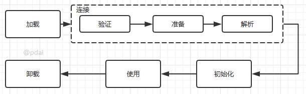
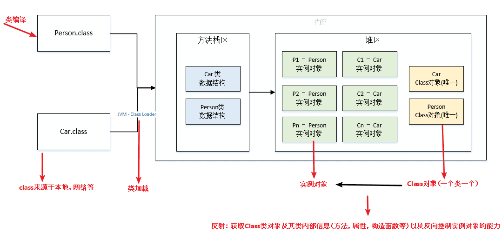
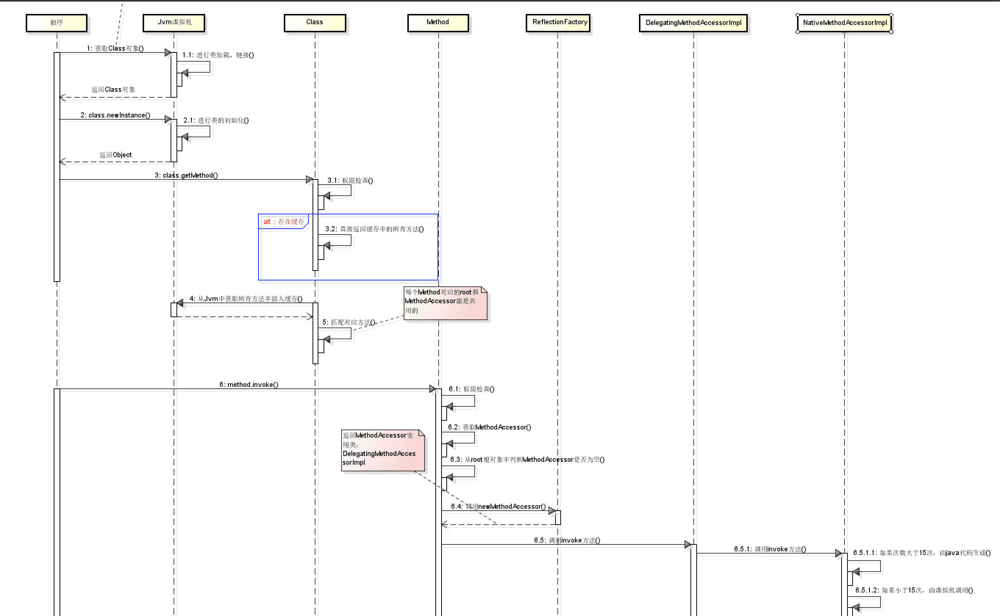

# java进阶-反射
JAVA反射机制是在运行状态中，对于任意一个类，都能够知道这个类的所有属性和方法；对于任意一个对象，都能够调用它的任意一个方法和属性；这种动态获取的信息以及动态调用对象的方法的功能称为java语言的反射机制。Java反射机制在框架设计中极为广泛，需要深入理解。
## 反射基础
* RTTI: Run-Time Type Identification 运行时类型识别,在运行时识别一个对象的类型和类的信息
* 反射：运行时发现和使用类的信息，反射技术可以对一个类进行解剖，把个个组成部分映射成一个个对象

### Class类
Class类也是一个实实在在的类，存在于JDK的java.lang包中。Class类的实例表示java应用运行时的类(class ans enum)或接口(interface and annotation)（每个java类运行时都在JVM里表现为一个class对象，可通过类名.class、类型.getClass()、Class.forName("类名")等方法获取class对象）。
数组同样也被映射为class 对象的一个类，所有具有相同元素类型和维数的数组都共享该 Class 对象。
基本类型boolean，byte，char，short，int，long，float，double和关键字void同样表现为 class 对象。

* Class类也是类的一种，与class关键字是不一样的。
* 手动编写的类被编译后会产生一个Class对象，其表示的是创建的类的类型信息，而且这个Class对象保存在同名.class的文件中(字节码文件)
* 每个通过关键字class标识的类，在内存中有且只有一个与之对应的Class对象来描述其类型信息，无论创建多少个实例对象，其依据的都是用一个Class对象。
* Class类只存私有构造函数，因此对应Class对象只能有JVM创建和加载
* Class类的对象作用是运行时提供或获得某个对象的类型信息，这点对于反射技术很重要(关于反射稍后分析)。

### 类加载
1. 类加载机制流程
   
2. 类加载
   

## 反射的使用
### Class类对象的获取 
在类加载的时候，jvm会创建一个class对象。class对象是可以说是反射中最常用的，获取class对象的方式的主要有三种
* 根据类名：类名.class
* 根据对象：对象.getClass()
* 根据全限定类名：Class.forName(全限定类名)

**Class类的方法**

| **方法名**         | **说明**                                                     |
| ------------------ | ------------------------------------------------------------ |
| forName()          | (1)获取Class对象的一个引用，但引用的类还没有加载(该类的第一个对象没有生成)就加载了这个类。(2)为了产生Class引用，forName()立即就进行了初始化。 |
| Object-getClass()  | 获取Class对象的一个引用，返回表示该对象的实际类型的Class引用。 |
| getName()          | 取全限定的类名(包括包名)，即类的完整名字。                   |
| getSimpleName()    | 获取类名(不包括包名)                                         |
| getCanonicalName() | 获取全限定的类名(包括包名)                                   |
| isInterface()      | 判断Class对象是否是表示一个接口                              |
| getInterfaces()    | 返回Class对象数组，表示Class对象所引用的类所实现的所有接口。 |
| getSupercalss()    | 返回Class对象，表示Class对象所引用的类所继承的直接基类。应用该方法可在运行时发现一个对象完整的继承结构。 |
| newInstance()      | 返回一个Oject对象，是实现“虚拟构造器”的一种途径。使用该方法创建的类，必须带有无参的构造器。 |
| getFields()        | 获得某个类的所有的公共（public）的字段，包括继承自父类的所有公共字段。 类似的还有getMethods和getConstructors。 |
| getDeclaredFields  | 获得某个类的自己声明的字段，即包括public、private和proteced，默认但是不包括父类声明的任何字段。类似的还有getDeclaredMethods和getDeclaredConstructors。 |

**getName、getCanonicalName与getSimpleName的区别**：

- getSimpleName：只获取类名
- getName：类的全限定名，jvm中Class的表示，可以用于动态加载Class对象，例如Class.forName。
- getCanonicalName：返回更容易理解的表示，主要用于输出（toString）或log打印，大多数情况下和getName一样，但是在内部类、数组等类型的表示形式就不同了。

**Constructor类及其用法**

> Constructor类存在于反射包(java.lang.reflect)中，反映的是Class 对象所表示的类的构造方法。

获取Constructor对象是通过Class类中的方法获取的，Class类与Constructor相关的主要方法如下：

| **方法返回值**   | **方法名称**                                       | **方法说明**                                              |
| ---------------- | -------------------------------------------------- | --------------------------------------------------------- |
| static Class<?>  | forName(String className)                          | 返回与带有给定字符串名的类或接口相关联的 Class 对象。     |
| Constructor      | getConstructor(Class<?>... parameterTypes)         | 返回指定参数类型、具有public访问权限的构造函数对象        |
| Constructor<?>[] | getConstructors()                                  | 返回所有具有public访问权限的构造函数的Constructor对象数组 |
| Constructor      | getDeclaredConstructor(Class<?>... parameterTypes) | 返回指定参数类型、所有声明的（包括private）构造函数对象   |
| Constructor<?>[] | getDeclaredConstructors()                          | 返回所有声明的（包括private）构造函数对象                 |
| T                | newInstance()                                      | 调用无参构造器创建此 Class 对象所表示的类的一个新实例。   |

关于**Constructor类本身一些常用方法**如下(仅部分，其他可查API)

| **方法返回值** | **方法名称**                    | **方法说明**                                                 |
| -------------- | ------------------------------- | ------------------------------------------------------------ |
| Class          | getDeclaringClass()             | 返回 Class 对象，该对象表示声明由此 Constructor 对象表示的构造方法的类,其实就是返回真实类型（不包含参数） |
| Type[]         | getGenericParameterTypes()      | 按照声明顺序返回一组 Type 对象，返回的就是 Constructor对象构造函数的形参类型。 |
| String         | getName()                       | 以字符串形式返回此构造方法的名称。                           |
| Class<?>[]     | getParameterTypes()             | 按照声明顺序返回一组 Class 对象，即返回Constructor 对象所表示构造方法的形参类型 |
| T              | newInstance(Object... initargs) | 使用此 Constructor对象表示的构造函数来创建新实例             |
| String         | toGenericString()               | 返回描述此 Constructor 的字符串，其中包括类型参数。          |
### Field类及其用法
Field 提供有关类或接口的单个字段的信息，以及对它的动态访问权限。反射的字段可能是一个类（静态）字段或实例字段。

同样的道理，我们可以通过Class类的提供的方法来获取代表字段信息的Field对象，Class类与Field对象相关方法如下：

| **方法返回值** | **方法名称**                  | **方法说明**                                                 |
| -------------- | ----------------------------- | ------------------------------------------------------------ |
| Field          | getDeclaredField(String name) | 获取指定name名称的(包含private修饰的)字段，不包括继承的字段  |
| Field[]        | getDeclaredFields()           | 获取Class对象所表示的类或接口的所有(包含private修饰的)字段,不包括继承的字段 |
| Field          | getField(String name)         | 获取指定name名称、具有public修饰的字段，包含继承字段         |
| Field[]        | getFields()                   | 获取修饰符为public的字段，包含继承字段                       |

关于Field类还有其他常用的方法如下：

| **方法返回值** | **方法名称**                  | **方法说明**                                                 |
| -------------- | ----------------------------- | ------------------------------------------------------------ |
| void           | set(Object obj, Object value) | 将指定对象变量上此 Field 对象表示的字段设置为指定的新值。    |
| Object         | get(Object obj)               | 返回指定对象上此 Field 表示的字段的值                        |
| Class<?>       | getType()                     | 返回一个 Class 对象，它标识了此Field 对象所表示字段的声明类型。 |
| boolean        | isEnumConstant()              | 如果此字段表示枚举类型的元素则返回 true；否则返回 false      |
| String         | toGenericString()             | 返回一个描述此 Field（包括其一般类型）的字符串               |
| String         | getName()                     | 返回此 Field 对象表示的字段的名称                            |
| Class<?>       | getDeclaringClass()           | 返回表示类或接口的 Class 对象，该类或接口声明由此 Field 对象表示的字段 |
| void           | setAccessible(boolean flag)   | 将此对象的 accessible 标志设置为指示的布尔值,即设置其可访问性 |

### Method类及其用法

下面是Class类获取Method对象相关的方法：

| **方法返回值** | **方法名称**                                               | **方法说明**                                                 |
| -------------- | ---------------------------------------------------------- | ------------------------------------------------------------ |
| Method         | getDeclaredMethod(String name, Class<?>... parameterTypes) | 返回一个指定参数的Method对象，该对象反映此 Class 对象所表示的类或接口的指定已声明方法。 |
| Method[]       | getDeclaredMethods()                                       | 返回 Method 对象的一个数组，这些对象反映此 Class 对象表示的类或接口声明的所有方法，包括公共、保护、默认（包）访问和私有方法，但不包括继承的方法。 |
| Method         | getMethod(String name, Class<?>... parameterTypes)         | 返回一个 Method 对象，它反映此 Class 对象所表示的类或接口的指定公共成员方法。 |
| Method[]       | getMethods()                                               | 返回一个包含某些 Method 对象的数组，这些对象反映此 Class 对象所表示的类或接口（包括那些由该类或接口声明的以及从超类和超接口继承的那些的类或接口）的公共 member 方法。 |

Method类的常用方法

| **方法返回值** | **方法名称**                       | **方法说明**                                                 |
| -------------- | ---------------------------------- | ------------------------------------------------------------ |
| Object         | invoke(Object obj, Object... args) | 对带有指定参数的指定对象调用由此 Method 对象表示的底层方法。 |
| Class<?>       | getReturnType()                    | 返回一个 Class 对象，该对象描述了此 Method 对象所表示的方法的正式返回类型,即方法的返回类型 |
| Type           | getGenericReturnType()             | 返回表示由此 Method 对象所表示方法的正式返回类型的 Type 对象，也是方法的返回类型。 |
| Class<?>[]     | getParameterTypes()                | 按照声明顺序返回 Class 对象的数组，这些对象描述了此 Method 对象所表示的方法的形参类型。即返回方法的参数类型组成的数组 |
| Type[]         | getGenericParameterTypes()         | 按照声明顺序返回 Type 对象的数组，这些对象描述了此 Method 对象所表示的方法的形参类型的，也是返回方法的参数类型 |
| String         | getName()                          | 以 String 形式返回此 Method 对象表示的方法名称，即返回方法的名称 |
| boolean        | isVarArgs()                        | 判断方法是否带可变参数，如果将此方法声明为带有可变数量的参数，则返回 true；否则，返回 false。 |
| String         | toGenericString()                  | 返回描述此 Method 的字符串，包括类型参数。                   |

##  反射流程

1. 反射类及反射方法的获取，都是通过从列表中搜寻查找匹配的方法，所以查找性能会随类的大小方法多少而变化
2. 每个类都会有一个与之对应的Class实例，从而每个类都可以获取method反射方法，并作用到其他实例身上；
3. 反射也是考虑了线程安全的，放心使用；
4. 反射使用软引用relectionData缓存class信息，避免每次重新从jvm获取带来的开销；
5. 反射调用多次生成新代理Accessor, 而通过字节码生存的则考虑了卸载功能，所以会使用独立的类加载器；
6. 当找到需要的方法，都会copy一份出来，而不是使用原来的实例，从而保证数据隔离；
7. 调度反射方法，最终是由jvm执行invoke0()执行

