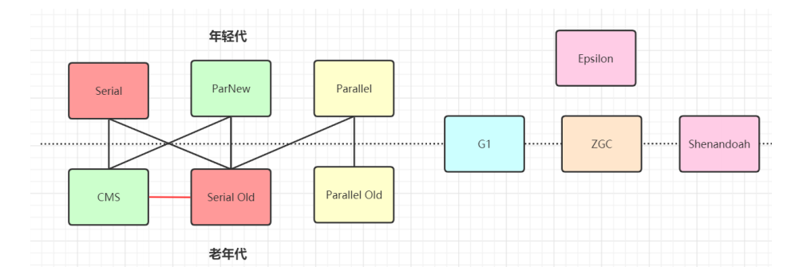
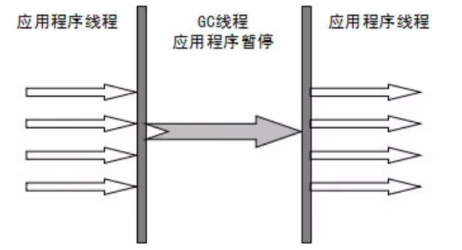
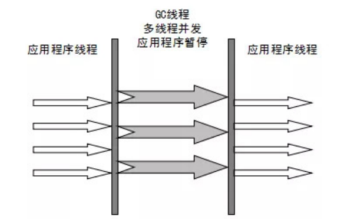
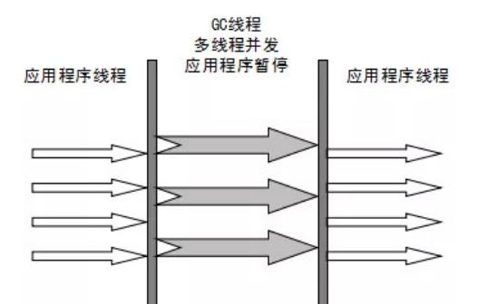
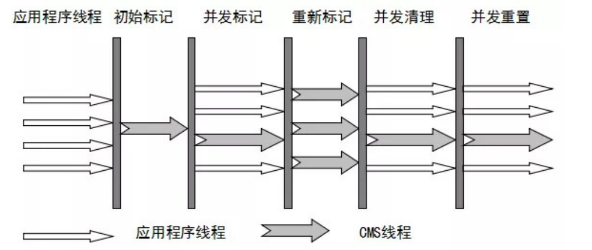
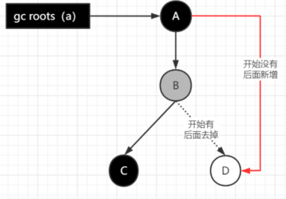
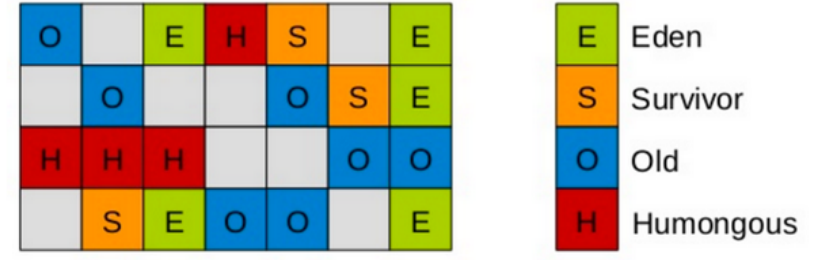
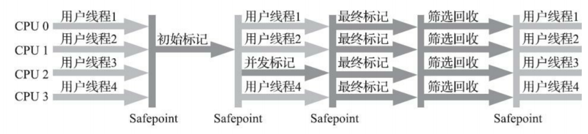

# jvm-垃圾回收机制

### 1. 垃圾收集算法

* 分代收集理论：
  * 当前虚拟机的垃圾收集都采用分代收集算法，一般将java堆分为新生代和老年代，这样我们就可以根据各个年代的特点选择合适的垃圾收集算法。
    * 在新生代中，每次收集都会有大量对象(近99%)死去，所以可以选择复制算法。只需要付出少量对象的复制成本就可以完成每次垃圾收集
    * 老年代的对象存活几率是比较高的，而且没有额外的空间对它进行分配担保，所以我们必须选择“标记-清除”或“标记-整理”算法进行垃圾收集
    * “标记-清除”或“标记-整理”算法会比复制算法慢10倍以上。
* **标记-复制算法**
  * 将内存分为大小相同的两块，每次使用其中的一块，当这一块的内存使用完后，就将还存活的对象复制到另一块去，然后再把使用的空间一次清理掉。这样就使每次的内存回收都是对内存区间的一半进行回收。
* **标记-清除算法**
  * 算法分为“标记”和“清除”阶段：标记存活的对象， 统一回收所有未被标记的对象(一般选择这种)；也可以反过来，标记出所有需要回收的对象，在标记完成后统一回收所有被标记的对象
  * 问题：
    * **效率问题 (如果需要标记的对象太多，效率不高)**
    * **空间问题（标记清除后会产生大量不连续的碎片）**
* **标记-整理算法**
  * 标记过程仍然与“标记-清除”算法一样，但后续步骤不是直接对可回收对象回收，而是让所有存活的对象向一端移动，然后直接清理掉端边界以外的内存。

### 2. 垃圾收集器

**如果说收集算法是内存回收的方法论，那么垃圾收集器就是内存回收的具体实现。**

虽然我们对各个收集器进行比较，但并非为了挑选出一个最好的收集器。因为直到现在为止还没有最好的垃圾收集器出现，更加没有万能的垃圾收集器，**我们能做的就是根据具体应用场景选择适合自己的垃圾收集器**。试想一下：如果有一种四海之内、任何场景下都适用的完美收集器存在，那么我们的Java虚拟机就不会实现那么多不同的垃圾收集器了。

#### 2.1Serial收集器(-XX:+UseSerialGC -XX:+UseSerialOldGC)

* Serial（串行）收集器是最基本、历史最悠久的垃圾收集器了.
* 是一个单线程收集器，
* **“单线程”** 的意义不仅仅意味着它只会使用一条垃圾收集线程去完成垃圾收集工作，更重要的是它在进行垃圾收集工作的时候必须暂停其他所有的工作线程（ **"Stop The World"** ），直到它收集结束
* **新生代采用复制算法，老年代采用标记-整理算法**

* 后续的垃圾收集器设计都是为了减少STW的时间
* 优势：
  * **简单而高效**、
* **Serial Old收集器是Serial收集器的老年代版本**
  * 一种用途是在JDK1.5以及以前的版本中与Parallel Scavenge收集器搭配使用
  * **CMS收集器的后备方案**

#### 2.2 Parallel Scavenge收集器(-XX:+UseParallelGC(年轻代),-XX:+UseParallelOldGC(老年代))

* **Parallel**收集器其实**就是Serial收集器的多线程版本**

* 默认的收集线程数跟cpu核数相同，当然也可以用参数(-XX:ParallelGCThreads)指定收集线程数，但是一般不推荐修改

* Parallel Scavenge收集器关注点是吞吐量（高效率的利用CPU）,CMS等垃圾收集器的关注点更多的是用户线程的停顿时间（提高用户体验
  * 吞吐量就是CPU中用于运行用户代码的时间与CPU总消耗时间的比值
  
* **新生代采用复制算法，老年代采用标记-整理算法**

  

* **Parallel Old收集器是Parallel Scavenge收集器的老年代版本**

  * 多线程
  * 标记-整理算法

* 在注重吞吐量以及CPU资源的场合，都可以优先考虑 Parallel Scavenge收集器和Parallel Old收集器(**JDK8默认的新生代和老年代收集**

  **器**)。

#### 2.3 ParNew收集器(-XX:+UseParNewGC)

* ParNew收集器其实**跟Parallel收集器很类似**，区别主要在于它可以和CMS收集器配合使用
* **新生代采用复制算法，老年代采用标记-整理算法**

* 它是许多运行在Server模式下的虚拟机的首要选择，除了Serial收集器外，只有它能与CMS收集器（真正意义上的并发收集器，后面会介绍到）配合工作

#### 2.4 CMS收集器(-XX:+UseConcMarkSweepGC(old))

* **CMS（Concurrent Mark Sweep）收集器是一种以获取最短回收停顿时间为目标的收集器**

* CMS收集器是一种 **“标记-清除”算法**

  * **初始标记：** 暂停所有的其他线程(STW)，并记录下gc roots**直接能引用的对象**，**速度很快**
  * **并发标记：** 并发标记阶段就是从GC Roots的直接关联对象开始遍历整个对象图的过程， 这个过程耗时较长但不需要停顿用户线程， 可以与垃圾收集线程一起并发运行。因为用户程序继续运行，可能会有导致已经标记过的对象状态发生改变
  * **重新标记：**重新标记阶段就是为了修正并发标记期间因为用户程序继续运行而导致标记产生变动的那一部分对象的标记记录，这个阶段的停顿时间一般会比初始标记阶段的时间稍长，远远比并发标记阶段时间短。主要用到三色标记里的增量更新算法(见下面详解)做重新标记。
  * **并发清理：** 开启用户线程，同时GC线程开始对未标记的区域做清扫。这个阶段如果有新增对象会被标记为黑色不做任何处理
  * **并发重置：**重置本次GC过程中的标记数据

  

* 优点：

  * **并发收集**
  * **低停顿**

* 缺点：

  * 对CPU资源敏感（会和服务抢资源）
  * 无法处理**浮动垃圾**(在并发标记和并发清理阶段又产生垃圾，这种浮动垃圾只能等到下一次gc再清理了)；
  * 它使用的回收算法-**“标记-清除”算法**会导致收集结束时会有**大量空间碎片**产生，当然通过参数-X:+UseCMSCompactAtFullCollection可以让jvm在执行完标记清除后再做整理
    * 执行过程中的不确定性，会存在上一次垃圾回收还没执行完，然后垃圾回收又被触发的情况，特别是在并发标记和并发清理阶段会出现，一边回收，系统一边运行，也许没回收完就再次触发full gc，也就是"concurrent mode failure"，此时会进入stop the world，用serial old垃圾收集器来回收
  
* **CMS的相关核心参数**

  1. -XX:+UseConcMarkSweepGC：启用cms
  1. -XX:ConcGCThreads：并发的GC线程数
  1. -XX:+UseCMSCompactAtFullCollection：FullGC之后做压缩整理（减少碎片）
  1. -XX:CMSFullGCsBeforeCompaction：多少次FullGC之后压缩一次，默认是0，代表每次FullGC后都会压缩一次
  1. -XX:CMSInitiatingOccupancyFraction: 当老年代使用达到该比例时会触发FullGC（默认是92，这是百分比）
  1. -XX:+UseCMSInitiatingOccupancyOnly：只使用设定的回收阈值(-XX:CMSInitiatingOccupancyFraction设定的值)，如果不指定，JVM仅在第一次使用设定值，后续则会自动调整
  1. -XX:+CMSScavengeBeforeRemark：在CMS GC前启动一次minor gc，目的在于减少老年代对年轻代的引用，降低CMS GC的标记阶段时的开销，一般CMS的GC耗时 80%都在标记阶段
  1. -XX:+CMSParallellnitialMarkEnabled：表示在初始标记的时候多线程执行，缩短STW
  1. -XX:+CMSParallelRemarkEnabled：在重新标记的时候多线程执行，缩短STW;
* 三色标记

  * 在并发标记的过程中，因为标记期间应用线程还在继续跑，对象间的引用可能发生变化，多标和漏标的情况就有可能发生。

  * **三色标记：**把Gcroots可达性分析遍历对象过程中遇到的对象， 按照“是否访问过”这个条件标记成以下三种颜色：

    * **黑色**： 表示对象已经被垃圾收集器访问过， 且这个对象的所有引用都已经扫描过。黑色的对象代表已经扫描过， 它是安全存活的， 如果有其他对象引用指向了黑色对象， 无须重新扫描一遍。 黑色对象不可能直接（不经过灰色对象） 指向某个白色对象。
    * **灰色**： 表示对象已经被垃圾收集器访问过， 但这个对象上至少存在一个引用还没有被扫描过。
    * **白色**： 表示对象尚未被垃圾收集器访问过。 显然在可达性分析刚刚开始的阶段， 所有的对象都是白色的， 若在分析结束的阶段， 仍然是白色的对象， 即代表不可达。

    

* 记忆集和卡表
  
    * 在新生代做GCRoots可达性扫描过程中可能会碰到跨代引用的对象,去对老年代再去扫描效率太低了
    * 新生代可以引入记录集（Remember Set）的数据结构（记录从非收集区到收集区的指针集合），避免把整个老年代加入GCRoots扫描范围
    * 事实上并不只是新生代、 老年代之间才有跨代引用的问题， 所有涉及部分区域收集（Partial GC） 行为的垃圾收集器
    * 垃圾收集场景中，收集器只需通过记忆集判断出某一块非收集区域是否存在指向收集区域的指针即可，无需了解跨代引用指针的全部细节
    * hotspot使用一种叫做“卡表”(cardtable)的方式实现记忆集，也是目前最常用的一种方式。关于卡表与记忆集的关系，可以类比为Java语言中HashMap与Map的关系
    * **卡表的维护：**卡表变脏上面已经说了，但是需要知道如何让卡表变脏，即发生引用字段赋值时，如何更新卡表对应的标识为1。Hotspot使用**写屏障**维护卡表状态。
    * 卡表是使用一个字节数组实现：CARD_TABLE[ ]，每个元素对应着其标识的内存区域一块特定大小的内存块，称为“卡页”。

#### 2.5 G1收集器（Garbage-First）

**G1 (Garbage-First)**是一款面向服务器的垃圾收集器,主要针对配备多颗处理器及大容量内存的机器. 以极高概率满足GC停顿时间要求的同时,还具备高吞吐量性能特征.

* G1将Java堆划分为多个大小相等的独立区域（**Region**），JVM最多可以有2048个Region。

  * 一般Region大小等于堆大小除以2048，比如堆大小为4096M，则Region大小为2M，当然也可以用参数"-XX:G1HeapRegionSize"手动指定Region大小，但是推荐默认的计算方式

* G1保留了年轻代和老年代的概念，但不再是物理隔阂了，它们都是（可以不连续）Region的集合。

  * 默认年轻代对堆内存的占比是5%，如果堆大小为4096M，那么年轻代占据200MB左右的内存，对应大概是100个Region
  * 可以通过“-XX:G1NewSizePercent”设置新生代初始占比，在系统运行中，JVM会不停的给年轻代增加更多的Region.
  * 最多新生代的占比不会超过60%，可以通过“-XX:G1MaxNewSizePercent”调整。年轻代中的Eden和Survivor对应的region也跟之前一样，默认8:1:1。年轻代现在有1000个region，eden区对应800个，s0对应100个，s1对应100个
  * 一个Region可能之前是年轻代，如果Region进行了垃圾回收，之后可能又会变成老年代，也就是说Region的区域功能可能会动态变化
  * G1有专门分配大对象的Region叫**Humongous区**，而不是让大对象直接进入老年代的Region中
    * 在G1中，大对象的判定规则就是一个大对象超过了一个Region大小的50%，比如按照上面算的，每个Region是2M，只要一个大对象超过了1M，就会被放入Humongous中，而且一个大对象如果太大，可能会横跨多个Region来存放
    * Humongous区专门存放短期巨型对象，不用直接进老年代，可以节约老年代的空间，避免因为老年代空间不够的GC开销
  * Full GC的时候除了收集年轻代和老年代之外，也会将Humongous区一并回收。

* G1收集器一次GC的运作过程大致分为以下几个步骤

  

  * **初始标记**（initial mark，STW）：暂停所有的其他线程，并记录下gc roots直接能引用的对象，**速度很快** ；
  * **并发标记**（Concurrent Marking）：同CMS的并发标记
  * **最终标记**（Remark，STW）：同CMS的重新标记
  * **筛选回收**（Cleanup，STW）：筛选回收阶段首先对各个Region的**回收价值和成本进行排序**，根据用户所期望的GC停顿时间(可以用JVM参数 -XX:MaxGCPauseMillis指定)来制定回收计划

* 回收算法主要用的是复制算法，将一个region中的存活对象复制到另一个region中，这种不会像CMS那样回收完因为有很多内存碎片还需要整理一次，G1采用复制算法回收几乎不会有太多内存碎片

  * CMS回收阶段是跟用户线程一起并发执行的，G1因为内部实现太复杂暂时没实现并发回收，不过到了Shenandoah就实现了并发收集，Shenandoah可以看成是G1的升级版本

* **G1收集器在后台维护了一个优先列表，每次根据允许的收集时间，优先选择回收价值最大的Region(这也就是它的名字Garbage-First的由来)，比如一个Region花200ms能回收10M垃圾，另外一个Region花50ms能回收20M垃圾，在回收时间有限情况下，G1当然会优先选择后面这个Region回收**。这种使用Region划分内存空间以及有优先级的区域回收方式，保证了G1收集器在有限时间内可以尽可能高的收集效率。

被视为JDK1.7以上版本Java虚拟机的一个重要进化特征。它具备以下特点：

* **并行与并发**：G1能充分利用CPU、多核环境下的硬件优势，使用多个CPU（CPU或者CPU核心）来缩短Stop The-World停顿时间。部分其他收集器原本需要停顿Java线程来执行GC动作，G1收集器仍然可以通过并发的方式让java程序继续执行。
* **分代收集**：虽然G1可以不需要其他收集器配合就能独立管理整个GC堆，但是还是保留了分代的概念。
* **空间整合**：与CMS的“标记--清理”算法不同，G1从整体来看是基于“**标记整理**”算法实现的收集器；从局部上来看是基于“复制”算法实现的。
* **可预测的停顿**：这是G1相对于CMS的另一个大优势，降低停顿时间是G1 和 CMS 共同的关注点，但G1 除了追求低停顿外，还能建立**可预测的停顿时间模型**，能让使用者明确指定在一个长度为M毫秒的时间片段(通过参数"XX:MaxGCPauseMillis"指定)内完成垃圾收集。

