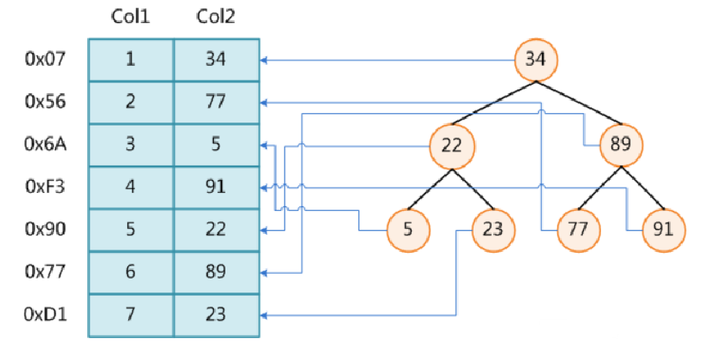
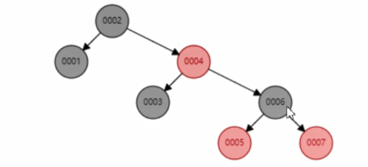
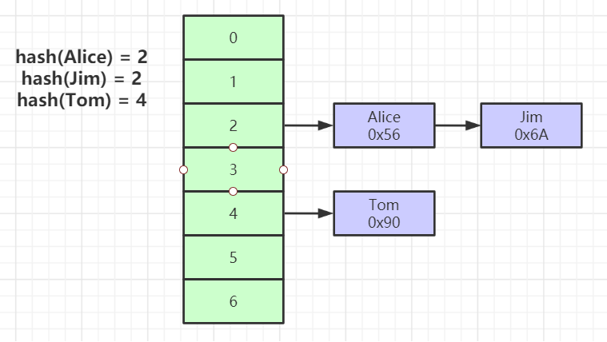
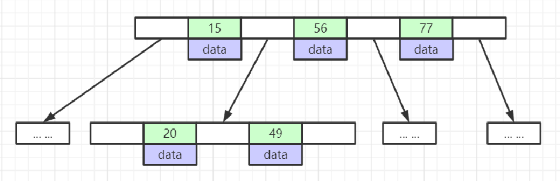
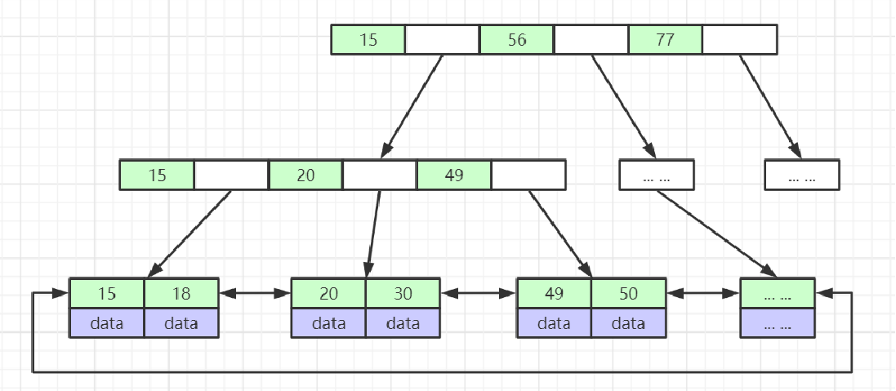
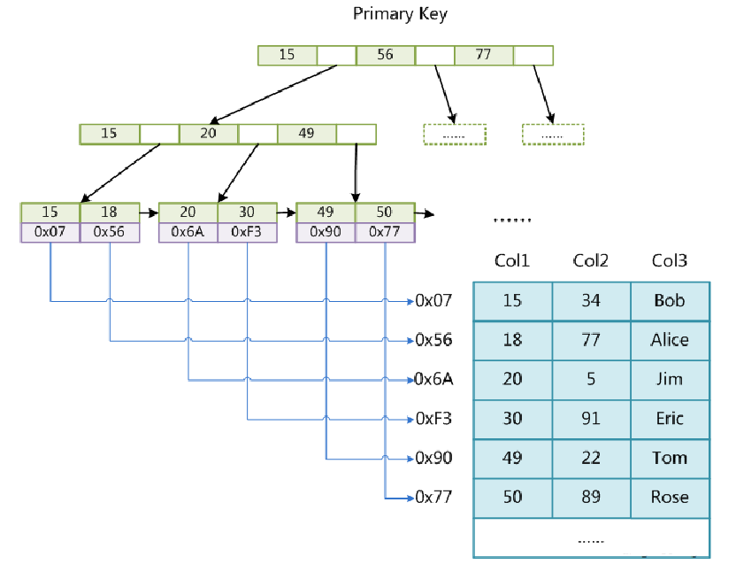

**索引的本质：**索引是帮助Mysql高效获取数据的**排好序**的**数据结构**

## 1. 索引的数据结构

### 1.1 二叉树

* 问题：
  * 树的深度比较深，查询一个索引会有很多的磁盘I/O

### 1.2 红黑树

* 平衡二叉树
* 问题：
  * 平衡二叉树会对树进行平衡，但是当数据有100万时，2^20 = 1024 * 1024 ,此时树的高度就达到了20，也就是需要20次磁盘IO

### 1.3Hash表

* 对索引的key进行一次hash计算就可以定位出数据存储的位置
* 很多时候Hash索引要比B+ 树索引更高效
* 问题
  * 仅能满足 “=”，“IN”，不支持范围查询
  * hash冲突问题

### 1.4 B树

*  叶节点具有相同的深度，叶节点的指针为空
* 所有的索引元素不重复
* 节点中的数据索引从左到右递增排列
* 问题：
  * 所有节点都会存储数据，这样也会导致树的层高比较高，磁盘I/O还是比较多

### 1.5 B+树

* 非叶子节点不存储data，只存储索引(冗余)，可以放更多的索引
* 叶子节点包含所有索引字段
  * 叶子节点用指针连接，提高区间访问的性能

## 2.存储引擎

存储引擎在表级别生效

### 1. MyISAM

* *.frm : 数据表结构相关的文件

* *.MYD：存储数据库数据的文件

* *.MYI：存储索引相关的文件

* MyISAM索引文件和数据文件是分离的(非聚集)

  ​	

* 

### 2.INNODB

* *.frm:数据表结构相关的文件

* *.ibd:存储索引和数据的文件

* InnoDB索引实现(聚集)

  * 表数据文件本身就是按B+Tree组织的一个索引结构文件
  * 聚集索引-叶子节点包含了完整的数据记录（一般主键的叶子节点是包含了完整的数据记录，是聚集索引）
  * 为什么建议InnoDB表必须建主键，并且推荐使用整型的自增主键？
    * 数据使用B+树来存，建主键可以直接把主键当做聚集索引
    * 如果不建主键，Mysql自己会生成一个row_id生成聚集索引，一方面增加了Mysql的开销，一方面聚集索引对程序不可见不太友好
    * 整型：相对而言比较节省空间
    * 自增：自增减少树的平衡开销
  * 为什么非主键索引结构叶子节点存储的是主键值？(一致性和节省存储空间)

* 

